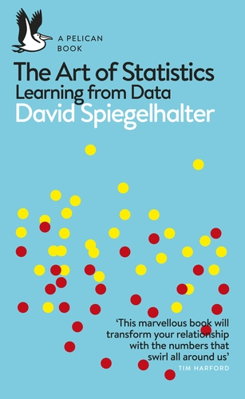

# statscourse

A Gentle Introduction to Statistics

## Summary

This is the webpage of the Introduction to Statistics course tought at ESBS Valencia by Angelo Basile.

# Book

There is no required reading for this course, but I can highly recommend to read the following book:

- David Spiegelhalter, /The Art of Statistics: Learning from Data/, Penguin, 2019

# Prerequisites

Only basic high school math is required for this course.

# Calendar

TBD

